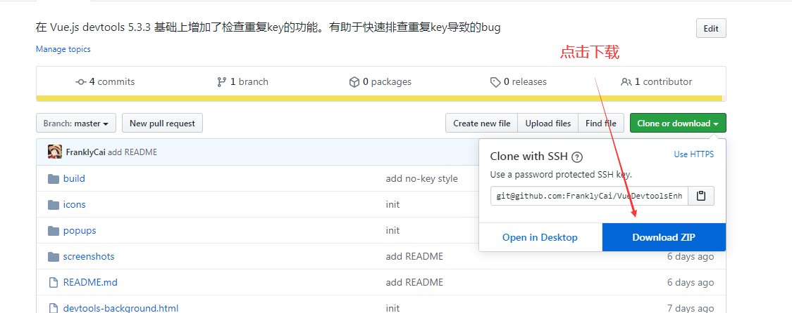
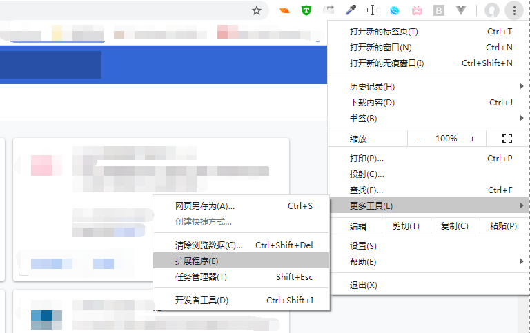
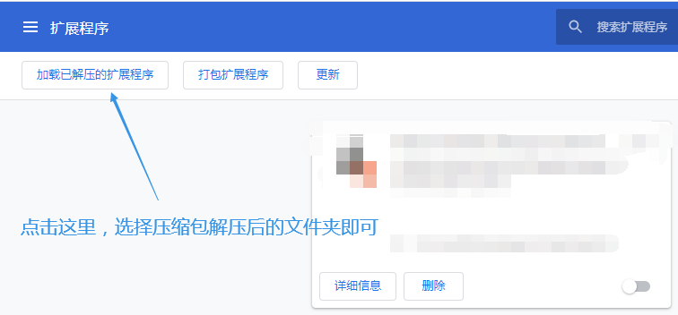

# Enhanced Vue.js Devtools （Vue.js Devtools 增强版）

该插件是基于 Vue.js devtools 5.3.3 的功能拓展版。它新增了一个`DuplicateKey（重复key）`面板，用于显示我们页面中有重复 key 问题的组件。它可以提示我们该组件位于 Dom 树中的什么位置，父组件是谁，以及在哪个源码文件中`（Open In Editor）`。使用它我们就可以快速有效地排查 Vue 中碰到的重复 key 问题了，简单实用，赶紧 pick 起来吧

## 安装

### ① 下载 git 压缩包并解压 （ 可以使用图示方法 或直接 `git clone` ）

### ② 在 chrome 中打开扩展程序页面

### ③ 点击加载已解压的扩展程序，选择解压或 clone 下来的那个文件夹，即可完成安装

## Demo

### 这里用 `Vue-cli` 创建了一个简单的项目，用于说明插件的使用

