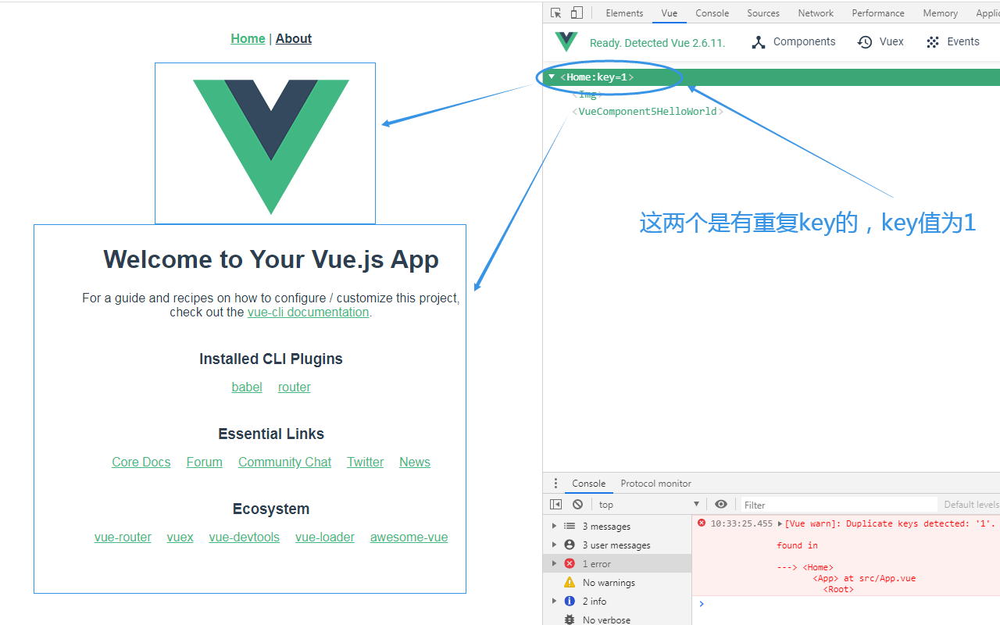
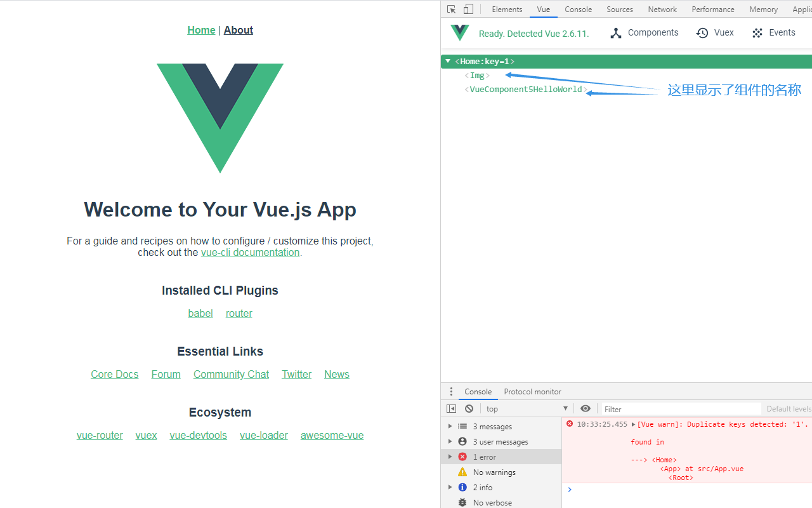
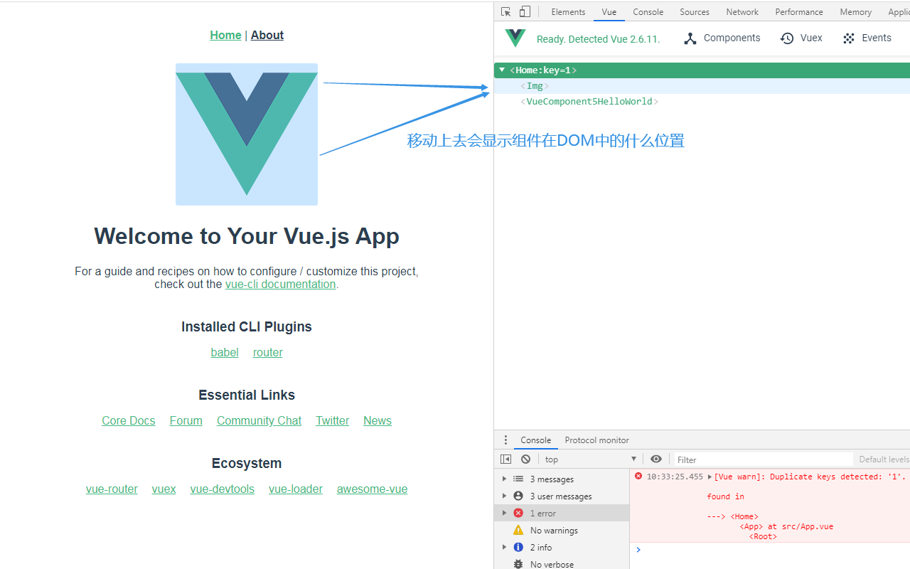
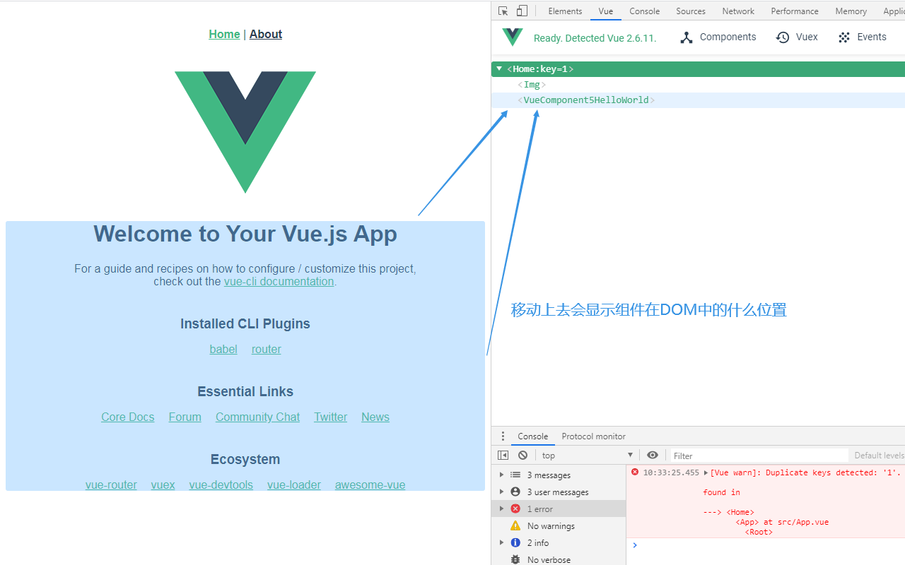
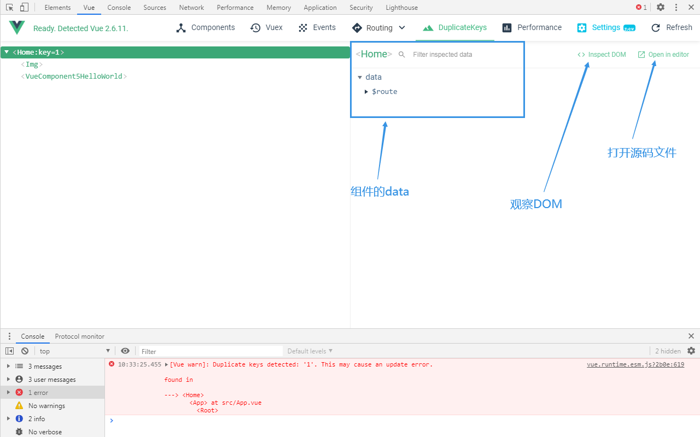

# Vue Devtools Enhanced（Vue Devtools 增强版）

该插件是基于Vue.js devtools 5.3.3的功能拓展版。它新增了一个`DuplicateKey（重复key）`面板，用于显示我们页面中有重复key问题的组件。它可以提示我们该组件位于Dom树中的什么位置，父组件是谁，以及在哪个源码文件中`（Open In Editor）`。使用它我们就可以快速有效地排查Vue中碰到的重复key问题了，简单实用，赶紧pick起来吧

## Demo
这里是用Vue-cli创建的一个示例项目，主要用于说明插件的使用

